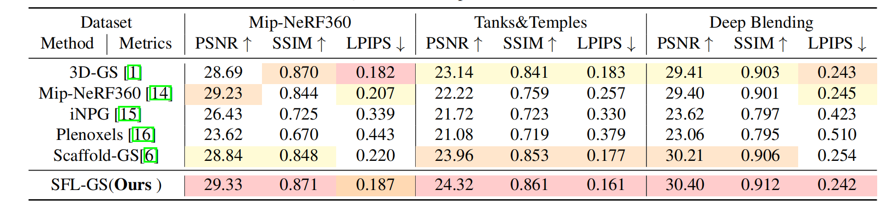

# SFL-GS

## Parameter Sensitivity Analysis

- **Early Feature Clustering Loss** : voxel size=0.01,  $L_{\text{feat}}$  starts >= 1 iteration
- **Fine Voxel Size** :  voxel size=0.001,  $L_{\text{feat}}$​  starts >= 2,000 iterations 
- **Best**: voxel size=0.01,  $L_{\text{feat}}$  starts >= 2,000 iterations 

| Parameters configuration      | PSNR&uarr; | SSIM&uarr; | LPIPS&darr; |
| ----------------------------- | :--------: | :--------: | :---------: |
| Early Feature Clustering Loss |   24.11    |   0.852    |    0.172    |
| Fine Voxel Size               |   24.13    |   0.857    |    0.169    |
| Best                          |   24.32    |   0.861    |    0.161    |

### Result Analysis：

**Early Feature Clustering Loss**：Early-stage deployment of feature clustering loss, prior to the stabilization of anchor feature representations, introduces high gradient variance and oscillatory behavior in the optimization trajectory, which undermines convergence and results in suboptimal model performance.

**Fine Voxel Size** :Excessively fine voxel resolution inherently amplifies high-frequency noise in the reconstructed representation. While progressive pruning strategies during optimization provide partial noise suppression, residual stochastic artifacts persist, ultimately degrading the perceptual quality and geometric fidelity of rendered outputs.

## Experimental Results Analysis

Our proposed method demonstrates superior performance compared to Scaffold-GS, attributable to two principal innovations. 

First, we introduce semantic-aware supervision to regularize anchor feature representations, which constitute a critical determinant of rendering fidelity. These anchor features serve as fundamental inputs to MLP decoders that predict per-Gaussian attributes including color and opacity distributions.

 Second, we implement pseudo-label guided optimization of Gaussian ellipsoid geometries. Conventional 3DGS approaches often generate anisotropically distributed Gaussians within object volumes, whereas our methodology enforces intra-object geometric consistency through size regularization. This constraint additionally mitigates pathological configurations such as needle-like Gaussians that adversely impact numerical stability and visual quality.